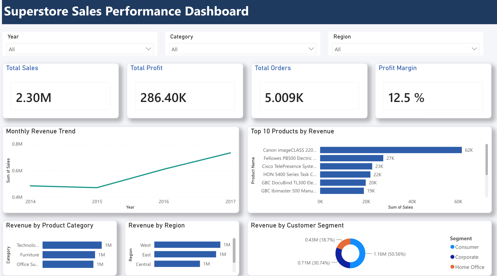

# Superstore Sales Performance Dashboard

An interactive Power BI dashboard analysing sales, profit, and order trends for a retail superstore dataset — built to surface revenue drivers across product category, region, and customer segment.



## Overview

This report answers three core business questions:
- **Where is revenue coming from?** — by product category, region, and customer segment
- **What's driving profitability?** — profit margin, top and bottom performing products
- **How is performance trending?** — monthly revenue trend over time

## Key Metrics
- **Total Sales:** 2.30M
- **Total Profit:** 286.40K
- **Total Orders:** 5,009
- **Profit Margin:** 12.5%

## Key Features
- KPI summary cards: Total Sales, Total Profit, Total Orders, Profit Margin
- Monthly revenue trend line chart with year/quarter/month drill
- Revenue breakdown by Product Category and Region
- Top 10 Products by Revenue
- Revenue share by Customer Segment (donut chart)
- Interactive slicers: Year, Category, Region
- Custom navy/teal color styling with a branded header banner and card-style visuals with drop shadows

## Data
- **Source:** Superstore Sales dataset (Order ID, Order Date, Sales, Profit, Category, Region, Product Name, Segment)
- **Rows:** *[add row count]*
- **Date range:** *[add date range covered]*

## Tools
Power BI Desktop, DAX, Power Query

## Key DAX Measures
```dax
Total Sales = SUM(Sales_Data[Sales])
Total Profit = SUM(Sales_Data[Profit])
Profit Margin = DIVIDE([Total Profit], [Total Sales])
```

## Screenshots
See `/screenshots` for full-page exports of the dashboard.

## How to Use
1. Download `Superstore_Sales_Model.pbix`
2. Open in [Power BI Desktop](https://powerbi.microsoft.com/desktop/) (Windows) or import into [Power BI Service](https://app.powerbi.com) (works on Mac/browser)
3. Data will refresh automatically if the source file path is available, or you can point it to your own copy of the dataset

## Author
Ei Phyu — [GitHub](https://github.com/epiasoo)
